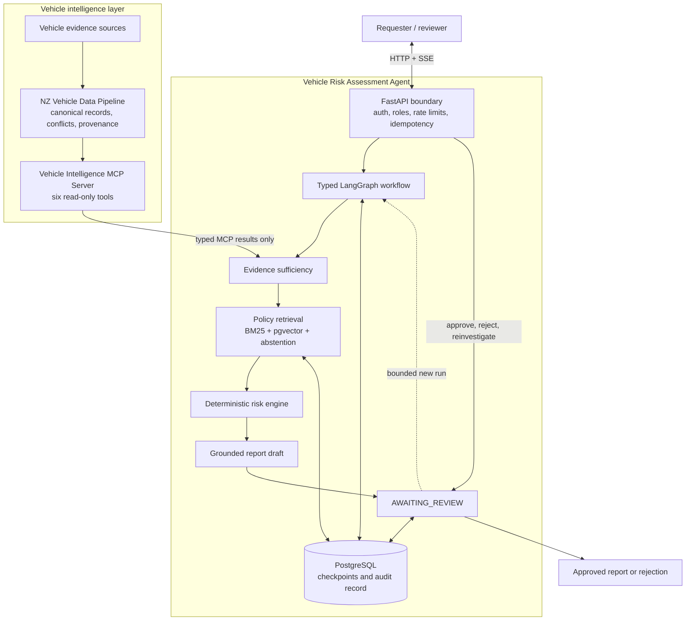
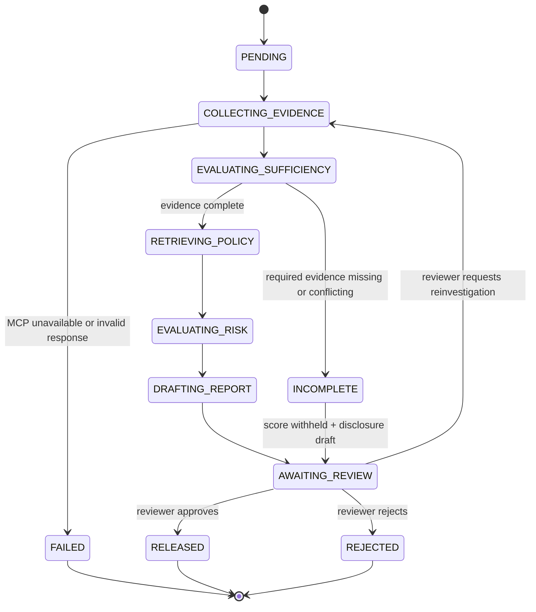

# Vehicle Risk Assessment Agent

[](https://github.com/sovorn-c/vehicle-risk-agent/actions/workflows/ci.yml)


**An auditable decision workflow for policy-grounded vehicle risk assessment.**

An MCP server can return vehicle facts. A consequential risk system must also decide whether the evidence is sufficient, retrieve applicable policy, calculate a reproducible score, explain the result, and stop for human review.

This service owns that decision layer. Typed LangGraph workflows coordinate MCP evidence, hybrid policy retrieval, deterministic scoring, cited report drafting, and explicit approval or reinvestigation.

> [!IMPORTANT]
> This is a reference implementation for engineering evaluation. It uses synthetic fixtures, does not access live restricted registers, and must not be used for legal, financial, safety, or purchase decisions.

## Explore the system

The fastest path uses the hosted synthetic MCP demonstration endpoint:

```bash
cp .env.example .env
bash scripts/smoke-quickstart.sh
```

The script checks MCP reachability, starts PostgreSQL and the Agent API, seeds versioned policies, and runs a complete assessment and review journey.

| Resource | Local URL | Purpose |
| --- | --- | --- |
| Workflow guide and safe explorer | [http://localhost:8001/docs](http://localhost:8001/docs) | Understand the system and try public health reads |
| Full Swagger reference | [http://localhost:8001/reference](http://localhost:8001/reference) | Inspect all authenticated operations |
| OpenAPI 3 contract | [http://localhost:8001/openapi.json](http://localhost:8001/openapi.json) | Machine-readable API definition |
| Health | [http://localhost:8001/health](http://localhost:8001/health) | Process liveness |
| Readiness | [http://localhost:8001/ready](http://localhost:8001/ready) | Database and dependency readiness |

The hosted endpoint has no uptime SLA. The full-local Compose setup remains the authoritative, reproducible path.

## Three repositories, three responsibilities

| Repository | Responsibility | Engineering focus |
| --- | --- | --- |
| [`nz-vehicle-data-pipeline`](https://github.com/sovorn-c/nz-vehicle-data-pipeline) | Reconciles conflicting source records into versioned canonical vehicles | Data integration, provenance, source authority, and immutable revisions |
| [`vehicle-mcp-server`](https://github.com/sovorn-c/vehicle-mcp-server) | Exposes audited vehicle intelligence through six read-only MCP tools | Typed contracts, transport parity, and safe service boundaries |
| **`vehicle-risk-agent`** | Produces policy-grounded assessments that require human review | Stateful orchestration, policy RAG, deterministic scoring, and decision safety |

The Agent never queries the Pipeline API or database directly. MCP is its only vehicle-evidence boundary, while the Pipeline remains the vehicle-data authority.

## What this demonstrates

- **Evidence sufficiency before scoring:** Missing or conflicting required evidence produces an explicit incomplete outcome. It is never interpreted as clean.
- **Deterministic risk calculation:** Versioned Python rules own the score, band, components, thresholds, and calculation hash. An LLM cannot change them.
- **Policy RAG with abstention:** BM25 and pgvector retrieval use Reciprocal Rank Fusion. Weak retrieval returns no citation instead of inventing one.
- **Grounded report drafting:** Model and offline adapters can explain evidence and policy, but every analytical claim must remain attributable.
- **Human-controlled release:** A report cannot leave `AWAITING_REVIEW` without an authorized approve, reject, or reinvestigate action.

## Scenario guide

The seeded demonstration covers four decision paths:

| Scenario | VIN | Input context | Expected outcome | Review action |
| --- | --- | --- | --- | --- |
| **Clean** | `1HGCR2F85HA000000` | Dealer purchase | `LOW_RISK`, score 12/100; complete evidence and no register matches | `APPROVE` releases the report |
| **Risky** | `1FA6P8CF8H5000000` | Private purchase | `HIGH_RISK`, score 88/100; PPSR interest, stolen listing, and statutory write-off | `REJECT` blocks release |
| **Incomplete evidence** | `JM0BL10F000000000` | Auction evaluation | `INCOMPLETE`; required register evidence is missing and the score is withheld | `APPROVE` requires an explicit waiver |
| **Reinvestigation** | `1HGCR2F85HA000000` | Targeted register re-check | Run 1 is reviewed, then a bounded additive Run 2 is created | `APPROVE` can release the later run |

All vehicle and register outcomes in these scenarios are synthetic.

## Architecture

FastAPI owns request, authorization, idempotency, event-stream, and human-review boundaries. LangGraph coordinates one assessment run. PostgreSQL stores checkpoints and the auditable domain record.



The drafting adapter receives the authoritative risk result. It can produce explanation text and citations, but it cannot select graph transitions or calculate the numeric score.

### Assessment lifecycle



Reinvestigation creates an additive audited run rather than replacing prior evidence or decisions.

## Example assessment report

A completed draft contains nine required sections. This abbreviated response shows four of them:

```json
{
  "id": "asmt_01J8N2Q1X...",
  "vin": "1HGCR2F85HA000000",
  "lifecycle_state": "RELEASED",
  "current_run_number": 1,
  "report": {
    "status": "RELEASED",
    "risk_score": 12,
    "risk_band": "LOW_RISK",
    "assessment_outcome": "SCORED",
    "sections": [
      {
        "section_type": "EXECUTIVE_SUMMARY",
        "title": "Executive Summary",
        "content": "Vehicle 1HGCR2F85HA000000 exhibits low overall risk based on available evidence..."
      },
      {
        "section_type": "MANDATORY_REVIEW_FINDINGS",
        "title": "Mandatory Review Findings",
        "content": "No statutory write-off, active stolen listing, or registered security interest detected."
      },
      {
        "section_type": "POLICY_CITATIONS",
        "title": "Applicable Policy Citations",
        "citations": [
          {
            "citation_id": "pol_ppsr_clearance_v1",
            "source_title": "PPSR Security Clearance Policy",
            "section_reference": "Section 3.2: Clean Encumbrance Verification"
          }
        ]
      },
      {
        "section_type": "SYNTHETIC_DATA_NOTICE",
        "title": "Synthetic Data Notice",
        "content": "This record represents no real vehicle, person, police report, insurance decision, or financial obligation."
      }
    ]
  }
}
```

## Quickstart

### Requirements

- Python 3.12+
- [`uv`](https://docs.astral.sh/uv/)
- Docker with Docker Compose v2.20+
- `curl`

### Option 1: Hosted MCP demonstration

The quickstart defaults to `https://vehicle-mcp.chhlatbot.com/mcp`.

```bash
cp .env.example .env
bash scripts/smoke-quickstart.sh
```

To use another compatible Streamable HTTP endpoint:

```bash
QUICKSTART_MCP_SERVER_URL=https://example.invalid/mcp \
  bash scripts/smoke-quickstart.sh
```

> [!NOTE]
> The hosted endpoint provides synthetic fixtures only and has no live restricted-register data. If its bounded `tools/list` probe fails, the script stops without a silent fallback. Use the full-local setup below.

### Option 2: Full-local Compose

Clone the sibling repositories beside this repository, then start all three application layers:

```bash
git clone git@github.com:sovorn-c/vehicle-mcp-server.git ../vehicle-mcp-server
git clone git@github.com:sovorn-c/nz-vehicle-data-pipeline.git ../nz-vehicle-data-pipeline
docker compose -f compose.yaml up -d --build --wait
```

| Service | Purpose | Local address |
| --- | --- | --- |
| `db` | PostgreSQL 16 with pgvector, using the psycopg driver | `localhost:54329` |
| `pipeline` | NZ Vehicle Data Pipeline | `localhost:8000` |
| `mcp` | Vehicle Intelligence MCP server | `localhost:8080` |
| `agent-api` | Vehicle Risk Assessment Agent | `localhost:8001` |

```bash
curl -f http://localhost:8001/health
curl -f http://localhost:8001/ready
```

## API reference

The API uses role-based bearer tokens, strict request schemas, and idempotency keys on mutating routes.

### Create an assessment

```bash
curl -X POST http://localhost:8001/api/v1/assessments \
  -H 'Authorization: Bearer dev-requester-token' \
  -H 'Content-Type: application/json' \
  -H 'Idempotency-Key: demo-asmt-001' \
  -d '{
    "vin": "1HGCR2F85HA000000",
    "context": {
      "sale_type": "DEALER",
      "intended_use": "Evaluate a vehicle before purchase",
      "questions": ["Are there material risk indicators?"]
    }
  }'
```

### Assessment operations

| Method | Endpoint | Description |
| --- | --- | --- |
| `POST` | `/api/v1/assessments` | Create an assessment; requires `Idempotency-Key` |
| `GET` | `/api/v1/assessments/{id}` | Retrieve lifecycle state, run history, and current phase |
| `GET` | `/api/v1/assessments/{id}/events` | Stream sanitized progress through Server-Sent Events |
| `GET` | `/api/v1/assessments/{id}/history` | Retrieve runs, state transitions, and reviewer actions |
| `GET` | `/api/v1/assessments/{id}/report` | Retrieve the released report; returns 404 before approval |
| `POST` | `/api/v1/assessments/{id}/review/approve` | Release a completed report draft |
| `POST` | `/api/v1/assessments/{id}/review/reject` | Reject a draft with a documented rationale |
| `POST` | `/api/v1/assessments/{id}/review/reinvestigate` | Create a bounded additive run with targeted evidence questions |

`/docs` is the branded workflow guide and safe explorer. `/reference` is the complete Swagger UI for authenticated operations. `/openapi.json` remains the authoritative contract.

## Engineering decisions

| Decision | Reason |
| --- | --- |
| Keep scoring outside the LLM | Pure versioned Python rules make scores reproducible, testable, and independent of generated prose |
| Require human approval | No consequential report is released without an explicit authorized decision |
| Persist LangGraph checkpoints | Interrupted runs, review pauses, and bounded reinvestigations survive process failure |
| Retrieve policy with abstention | Weak retrieval remains visible instead of becoming a fabricated citation |
| Gate scoring on evidence sufficiency | Unknown or conflicting required evidence cannot be treated as a clean result |
| Keep vehicle evidence behind MCP | The Agent cannot bypass tool contracts or duplicate Pipeline reconciliation logic |

## Code map

| Package | Responsibility |
| --- | --- |
| `api/` | FastAPI routes, schemas, authorization boundaries, SSE, and documentation |
| `workflow/` | Typed LangGraph state, nodes, transitions, runner, and checkpoint integration |
| `evidence/` | MCP result contracts, immutable snapshots, integrity checks, and sufficiency rules |
| `policy/` and `retrieval/` | Corpus lifecycle, hybrid retrieval, citation contracts, and abstention |
| `risk/` | Versioned deterministic policy and score calculation |
| `reporting/` | Nine-section report contracts, grounding validation, and drafting adapters |
| `review/` | Transactional approval, rejection, reinvestigation, and released-report behavior |
| `adapters/` | MCP, embedding, reranking, and LLM dependency boundaries |
| `persistence/` | SQLAlchemy models and repositories for auditable state |

## Verification

Run the complete seven-stage local gate:

```bash
bash scripts/check.sh
```

It checks formatting, Ruff, strict mypy, Alembic migrations, Compose contracts, the full pytest suite, and package building.

Run the end-to-end local smoke journey against a running stack:

```bash
bash scripts/smoke-local.sh
```

Individual entry points are also available:

```bash
uv run python -m vehicle_risk_agent.cli.seed
uv run python -m vehicle_risk_agent.cli.smoke
```

Coverage includes workflow transitions, MCP contract failures, evidence integrity, retrieval abstention, deterministic scoring, grounded drafting, concurrent review actions, checkpoint recovery, authorization, telemetry redaction, Docker delivery, and API contracts.

## Audit and safety properties

- Every MCP result is validated, hashed, and stored as an immutable point-in-time evidence snapshot.
- `UNKNOWN`, `UNRESOLVED`, absent, and conflicting evidence remain distinct throughout the workflow and report.
- Risk policies, retrieval configuration, score components, thresholds, and calculation hashes are versioned.
- Policy-supported claims retain policy IDs and section references; evidence claims retain source observation IDs.
- Unreviewed drafts remain in `AWAITING_REVIEW`; the system never auto-approves an assessment.
- Reinvestigation adds a new run and preserves all prior evidence, reports, and review actions.

## Security boundaries

- VINs, context payloads, policy text, MCP results, and model output are treated as untrusted input and validated with strict Pydantic schemas.
- Role-based authorization separates requester operations from reviewer decisions and prevents cross-assessment access.
- Intake routes enforce request-size bounds, bounded rate limits, and idempotency where required.
- Database access uses parameterized queries and explicit transactions for serialized review decisions.
- Errors and telemetry exclude credentials, prompts, raw exceptions, stack traces, and raw vehicle evidence.
- Development tokens in `.env.example` are for local testing only.

## Limitations

- This is a reference implementation, not an active commercial vehicle registry or professional decision service.
- All PPSR, stolen, write-off, dealer, and assessment outcomes are synthetic.
- The system does not connect to live NZTA, PPSR, Police, insurer, dealer, or other restricted-register services.
- Hosted MCP availability has no SLA; full-local Compose is the authoritative evaluation path.
- Offline drafting is the default. Live Anthropic drafting is optional and does not own scoring or workflow transitions.

## Troubleshooting

| Symptom | Resolution |
| --- | --- |
| Hosted MCP probe fails | Run `bash scripts/smoke-local.sh` with the full-local Compose stack |
| `pgvector` extension is missing | Verify the database container uses `pgvector/pgvector:pg16` |
| Port `54329` is occupied | Free the port or update `.env` and the Compose mapping |
| Report uses offline drafting | Set `ANTHROPIC_API_KEY` only when live drafting is required |
| Agent API is unhealthy | Run `docker compose logs agent-api` and verify migrations and dependency health |

## Cleanup

Remove the hosted quickstart stack and its data:

```bash
docker compose -p vehicle-risk-agent-quickstart -f compose.quickstart.yaml down -v
```

Remove the full-local stack and its data:

```bash
docker compose -f compose.yaml down -v
```

## Technology

Python 3.12, LangGraph, FastAPI, Pydantic v2, MCP Python SDK, SQLAlchemy 2, PostgreSQL, pgvector, Alembic, Anthropic SDK, uv, pytest, Ruff, mypy, Docker Compose, and GitHub Actions.
